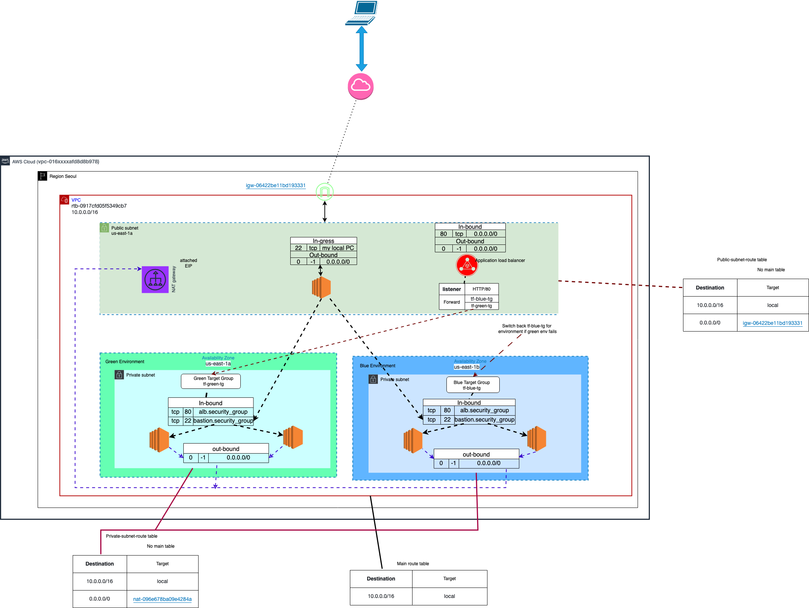

# README

---

# Blue-Green Deployment Project: Conceptual Notes

## 

## Project Goal

Implement a **zero-downtime** approach for web app updates using **Blue-Green** deployment on AWS.

## Blue-Green Deployment (Core Concept)

- **Two Environments**: “Blue” (live) and “Green” (new version).
- **Switch Traffic**: Once Green is tested, switch user traffic from Blue to Green instantly.
- **Rollback**: If issues arise, revert to Blue quickly.

## Architecture Overview

- **VPC**: Secure, private network for all AWS resources.
- **Subnets**:
    - **Public**: Hosts the Application Load Balancer (ALB) and a bastion host.
    - **Private**: Hosts Blue and Green servers, hidden from the internet.
- **ALB**: Distributes traffic between Blue and Green.
- **NAT Gateway**: Allows private servers to download updates without being publicly exposed.
- **Availability Zones**: Resources spread across zones for high availability (though shown as a single AZ in the diagram).

## Terraform Cloud

- **Infrastructure as Code**: Stores and manages AWS setup remotely.
- **Sensitive Data**: Retrieved from Terraform Cloud outputs rather than stored locally.

## Workflow

1. **Deploy Blue** (live version).
2. **Deploy & Test Green** (new version).
3. **Switch Traffic** to Green when stable.
4. **Monitor** performance; revert to Blue if issues arise.
5. **Update Blue** for the next release.

## Benefits

- **Reliability**: Always a working version online.
- **Flexibility**: Test new features safely.
- **Scalability**: Spread across multiple AZs.

## Challenges

- **Complex Setup**: Managing two environments.
- **Thorough Testing**: Ensuring both environments work properly.
- **Secure Access**: Requires a bastion host for private instances.

## Future Improvements

- **HTTPS** for secure user traffic.
- **Automated Switching** via a CI/CD pipeline.
- **Enhanced Monitoring** with alerts for quick issue detection.

##